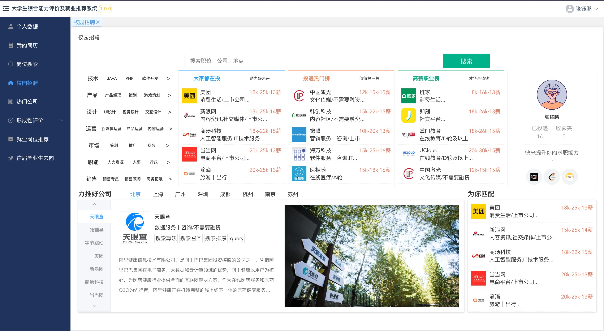

# 🎓 Campus

🚩 大学生就业推荐系统

该系统是我读书期间做的一个关于大学生就业推荐的项目。系统的主要功能模块包括校园招聘、学生管理、岗位管理、我的简历、岗位搜索、岗位详情、就业岗位推荐、往届毕业生去向几大基础模块。学生用户在登录成功后可以在我的简历模块编写个人简历，可以通过校园招聘、岗位搜索、往届生毕业去向几个模块了解现有的企业和岗位信息以及往届生的就业去向分布。系统管理员在登录成功后可在学生管理模块和岗位管理模块查看并编辑学生或岗位信息。当前只是部分前端代码，仅供参考...

This repo is a project about employment recommendations for college students that I did during my study. The main functional modules of the system include campus recruitment, student management, job management, my resume, job search, job details, job recommendation, previous graduates' whereabouts several basic modules. After logging in successfully, student users can write their resumes in the My Resume module, and they can learn about existing enterprises and positions as well as the employment destination distribution of past students through campus recruitment, job search, and graduation destination of past students. The system administrator can view and edit students or post information in the student management module and post management module after logging in successfully. Currently only part of the front-end code, just for reference only...
